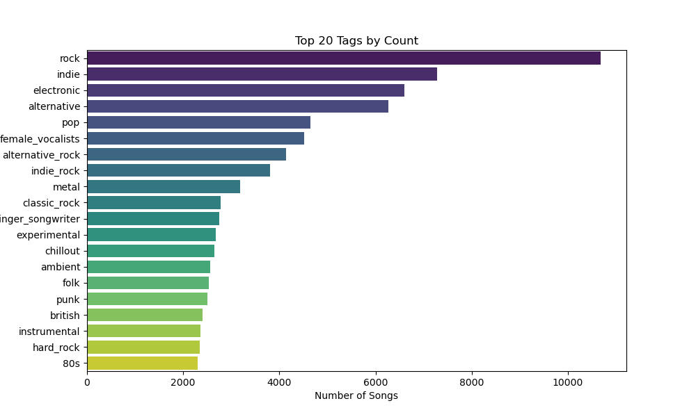
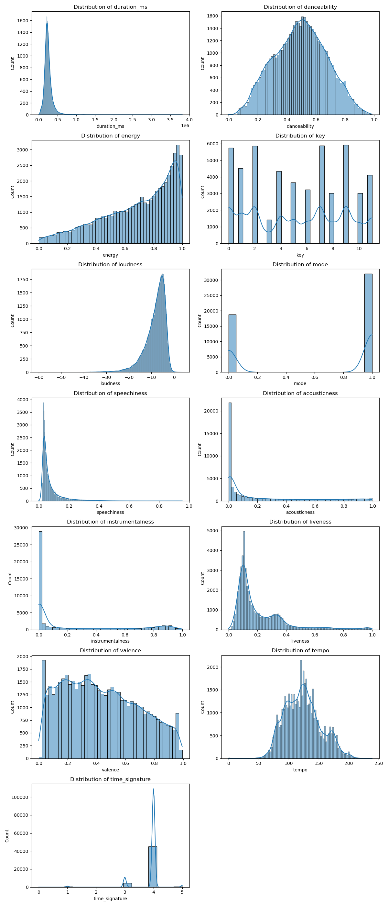
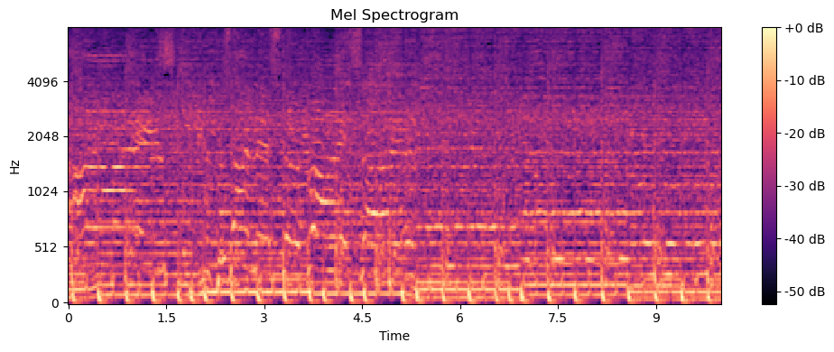
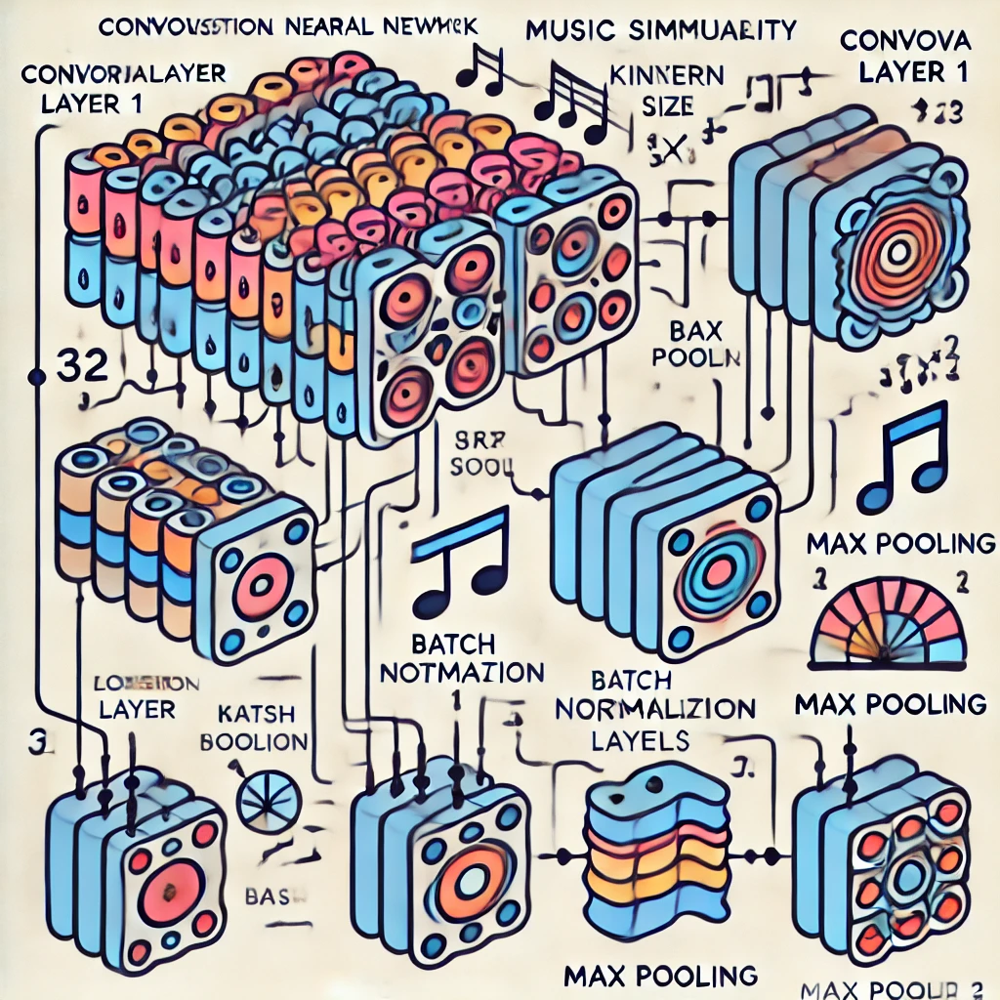
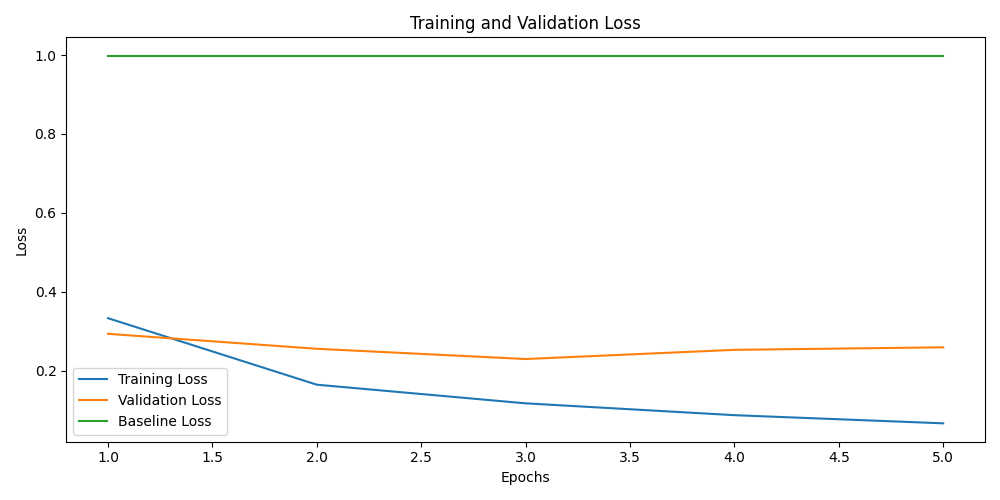

# Good Composers Borrow, Great Composers Steal
## *Analyzing Audio Similarity using Deep Learning*
#### Authors: Reggie Bain, Emelie Curl, Larsen Linov, Tong Shan, Glenn Young

## Summary
We worked on developing a model using several different approaches to analyze the similarity between songs by directly analyzing the audio. Using audio analysis techniques such as calculating log-mel spectrograms, audio augmentation, and transfer learning we established a way to compare the similarity between audio files for the purpose of detecting potential  plagiarism. Our work focuses on minimizing the so-called *triplet-loss* which aims to maximize the distance between images that are different while simultaenously minimizing the distance between similar images.
## Background
Throughout music history, composers and song writers have borrowed musical elements from each other. Similar chord progressions, rhythms, and melodies can often be found spanning different musical styles, genres, and eras. Our interest in the topic was sparked by many famous examples of composers throughout history borrowing musical structures and motifs from each other. One can hear obvious similarities in the works of Bach and Vivaldi from the baroque era and Mozart/Hayden from the classical era. In the music for Star Wars in 1977, John Williams incorporated similar leitmotifs as composer Igor Stravinsky used in his famous 1913 balet, *The Rite of Spring*. In modern music, courts have adjuticated disputes over similarities between songs. In 2015, for example, artists Robin Thicke and Pharrell Williams were sued for allegedly plagiarizing Marvin Gaye's song "Got to Give it Up" when writing their song "Blurred Lines." Marvin Gaye's estate ultimately won the $7.4 million case. These are just a few examples of audible similarities between musical works. Our project aimed to use deep learning to assess the similarity between music to potentially establish a more robust way to potentially detect music plagiarism.
## Dataset(s)
- Our data primarily came from the Million Song Dataset [1] as well as several Kaggle datasets [2] where authors paired known songs with links to preview of the songs from various APIs. We also wrote scripts to find song previews where we did not already have them. 
- We took 30s previews of the songs (in some case taking 10s clips of that 30s due to limitations in both compute and storage), and fed them into Librosa, a Python package built to work with and extract key features from audio. Although 30s clips are, obviously, not ideal for assessing the overall similarity of songs, we feel it is enough to capture many key features/sections of audio and can provide good enough data for a proof of concept of our methodology. This is also all that was available from mainstream APIs for obtaining 10k+ audio samples in a reasonable amount of time without significant cloud storage/compute.
- We ultimately focused on the audio from a set of around 50,000 songs that can be found in [in our data folder](./data/music_info.csv), a data set containing meta data and preview links to songs from the Kaggle dataset at [2]. This dataset also included information from the LastFM project [4] and a handful of engineered features such as *danceability, liveness, loudness* and many others., a project that aimed to compile songs from the Million Song Dataset and calculate a variety of features ranging from genre tags as well as identify cover songs, and track various musical features of songs. Of primary interest to us was the raw audio of songs rather than meta data or features calculated using said metadata.
- We spent a lot of time experimenting with ways to increase data quality (our main road block) by creating more robust triplets. [More information can be found about some of these efforts here.]()
## Stakeholders
- Artists looking to ensure their work is not plagiarized by others
- Record companies and courts looking to have an objective measure of song similarity
- Companies looking to better classify and recommend wider arrays of music to listeners
## Key Performance Indicators (KPIs)
- The model minimizes the *triplet-loss* function between a triplet of (anchor, similar, different) audio files to the degree that it will differentite between similar and different audio files.
- The model beats a baseline of calculating the triplet-loss between audio files **without** feeding those audio files into the model. We'll call this the "no-model" baseline.
- Study the nature of famous plagiarism cases and how these songs may be related in a way detectable by various metrics typically used in audio analysis.
## EDA + Feature Engineering
- We primarily focused on a Kaggle dataset that provided nearly 50k working links to previews of songs that could be used for audio analysis. The graphs below show some basic information about the release year, genre, and other tags of the provided songs.

### Augmenting Audio 
- In order to generate triplets of anchors (a given song), positives (songs very similar to the anchor), and negatives (songs different from the anchor) we needed to match each song in our dataset with a similar and "not similar" song. 
- **Negatives**: We selected random different songs within the dataset for each of our anchors. In some cases, random other songs will be likely have rather similar features to the anchor and in some cases they will be very different. This provides a diversity of harder and easier negatives for the model to learn.
- **Positives:** We used the Python package Audiomentations to perform augmentations to each the anchor songs and generate an altered, but still very similar audio file. For each of the songs in our dataset, we used a variety of augmentations such as: adding noise, time stretching, pitch shifting, and signal to noise ratio alterations. **NOTE:** One way to improve our data quality would be to make some of these positives cover songs of the originals, but gathering a large amount of these was a challenge, and we reserved them primarily for testing the model.
### Log-Mel Spectrograms
- Our analysis primarily focused on modeling the log-mel spectrograms of raw audio. A mel spectrogram is a plot of the frequencies present in an audio clip over time, mapped onto the *mel scale* [5]. 
- The mel scale is a perceptual scale that reflects how humans perceive sound, where frequencies are spaced in a way that better matches human hearing compared to a linear frequency scale.

    - **X-Axis -- Time**: Each point is a specific time interval derived from dividing the audio into small, overlapping windows.
    - **Y-Axis -- Frequency**: Frequencies converted to log-mel scale (the log of the mel scale)
    - **Color Scale -- Amplitude/Intensity:**: Color on the plot indicates the amplitude (again on a log scale) of the signal at a specific frequency and time.

## Modeling
### Triplet Loss

- Triplet loss is a loss function often used for tasks such as facial recognition. It aims to drive a model to create embeddings where similar items are closer together in the embedding space and dissimilar items are further apart. 
- Smaller values (closer to 0) indicate that the model is successfully distinguishing between the anchor and negatives (in our case, the randomly chosen different songs) while clustering the anchor and positives (in our case the augmented songs).

$\mathcal{L}(A, P, N) = \max(0, \|f(A) - f(P)\|_2 - \|f(A) - f(N)\|_2 + \alpha)$

Where:
- $A$ is the anchor sample.
- $P$ is the positive sample (a sample similar to $A$).
- $N$ is the negative sample (a sample different from $A$).
- $f(\cdots)$ represents the embedding function (e.g., a neural network).
- $\|\cdots\|_2$ denotes the Euclidean distance.
- $\alpha$ is the margin, a positive constant that ensures a gap between the positive and negative pairs.

### ResNet-18
- ResNet-18 [4] is a deep convolutional neural network (CNN), widely recognized for its ability to learn rich feature representations. It has 18 layers that include convolutional, pooling, and fully connected layers. The architecture is organized into a series of so-called *residual blocks* which aim to address vanishing gradients during backpropagation. Residual or "skip" connections bypass one or more layers to allow the input to a block to be added directly to the output after passing through the block's convolutional layers. A diagram of the the original Resnet-18 architecture is shown below, courtesy of [4].

- We used ResNet-18 to create embeddings of songs tha could then be used to calculate triplet loss. In theory, the network can extract feature embeddings that capture essential characteristics of each song (through capturing features of the images of log-mel spectrograms). The model is trained to minimize a triplet loss function, which aims to make embeddings where songs labeled as similar are closer in the embedding space and embeddings of songs labeled as dissimilar are pushed further apart.
- The results of our training/validation and a baseline that finds the triplet loss of the spectrograms **without** putting them through the model are shown below.
### CNN from Scratch
- We implemented a CNN from scratch to create 128 dimensional embeddings of our log-mel spectrograms for comparison. We again trained on a triplet loss function, looking to push embeddings of similar songs closer and different songs further from each other in Euclidean space.
- A diagram of the model generated by DALL-E can be found below. 

### Transformers
- We also experimented with transformer models. [You can read more about this here.]()
## Results
#### ResNet-18 Fine Tuned - Batch Size 64, Last Residual Block Unfrozen, 8 epochs
- Our first instinct was to try freezing most of the layers. We only unfroze the last "residual block", the final fully connected layers, and changed the input layer to only expect 1 channel (as opposed to 3 for RGB).
- This yielded good results but significant overfitting (even with dropout as high as 0.8!)
 

#### ResNet-18 Fine Tuned - Batch Size 32, All Layers Unfrozen, 8 epochs
- Unfreezing the lower layers helped reduce overfitting (dropout 0.5) and improved resuls as lower layers were allowed to adapt to our dataset.

#### CNN from Scratch -- Batch Size 32, 10 epochs
- Using a from scratch CNN shows tremendous promise with additional storage and compute. It lacks any obvious over fitting, 

### Summary & Best Results
- We'll define *best* as the model that produced the lowest triplet loss in the limited window we had for training (which may not yield the best results with more resources/time).
- The best performing model was the ResNet-18 fine tuned on a dataset of 10k triplets of songs. Positive songs were generated using augmentations of the anchors and all layers of the ResNet were frozen except for the layers in the 4th and final residual block and the final fully connected layer. 
- **Baseline:** We calculated the triplet loss of the anchor, positive, and negative song **without** feeding it into the model, averaging this value over the validation set.
- **Hyperparameters:** We varied batch size, dropout, weight decay, and learning rate to the extent we could With more GPU compute, we could do a more thorough grid search and train for dozens/hundreds of epochs at a time. 
- **Best Results:** We found the best performance using a batch size of 32, dropout rate of 0.5, a learning rate starting at $10^{-4}$ and all of the layers unfrozen, which yielded the training/validation curves shown above vs. the "no-model" baseline. 

| Metric | Result |
| --- | --- |
| Best Avg. Validation Triplet Loss| 0.1514 |
| Baseline Avg. Triplet Loss | 0.9983 |
| Pct Improvement over Baseline | 84.83% |
#### How the Model Affects the Embeddings
- Both our ResNet and CNN models show significant promise. With access to GPU compute beyond Kaggle's free tier allowance and more storage to use larger datasets, we're confident this model will continue to improve.
- To show what this looks like for actual triplets in our validation set here is an example of the separation of embeddings with and without the model. The model increases their Euclidean distance:

| Pair | Dist. w/ Model | Dist. w/o Model |
| ---- | ---- | ---- |
|Anchor-Positive | 0.7001| 0.2586 |
|Anchor-Negative | 0.7498| 0.2715 |
|Difference | -0.0497| -0.0129| 
- We can also test the model on triplet previously unseen by our model. Below, you'll see a similar results table (note these are not the exact recordings):
    1. [Procol Harum's song *A Whiter Shade of Pale*](https://www.youtube.com/watch?v=CJxpKlTID2Q) - Anchor
    2. [*A Whiter Shade of Pale* by Annie Lennox](https://www.youtube.com/watch?v=VZqPoriYXho) - Positive
    3. [*Abracadabra* by Steve Miller Band](https://www.youtube.com/watch?v=tY8B0uQpwZs) - Negative

| Pair | Dist. w/ Model | Dist. w/o Model |
| ---- | ---- | ---- |
|Anchor-Positive | 0.4495| 0.2329 |
|Anchor-Negative | 0.4890| 0.2492 |
|Difference | -0.0395| -0.0163|   
- Even with minimal training and limited data, the model does learn to separate songs by similarity.

## Notable Roadblocks
#### Compute
- Any amateur deep learning project will face compute issues and this was no exception. We made use of the free GPU services offered by both Google Colab and Kaggle, but given the limited time per week the free versions offer, thoroughly experimenting with different model hyperparameters and training for many epochs was difficult.
- For example, fine tuning ResNet18 on 10k triplets of songs for 6 epochs took ~7 hours on a Kaggle GPU, even when most model parameters were frozen. By default, Kaggle limits free tier users to jobs that take <= 12 hours to complete.
#### Storage
- Storage was another significant limitation. Storing the NumPy arrays of log-mel spectrograms of short samples of 10k songs in a Pickle/HD5 file takes over 10GB of storage space. When working locally (or even on Kaggle) without significant cloud resources, the data had to be carefully batched so as to not exceed our available hard disk space or alloted Kaggle storage. This also limited the length of audio samples that we could practically store/process.
- Limited RAM available locally or on Kaggle/Colab was also a challenge, as it prevented us from trying very large batch sizes (which speeds up training in many cases) or looking at larger datasets of more than 10k-20k songs at a time.
#### Rate Limiting & Download Restrictions
- Various APIs impose strict rate limiting often making data scraping time consuming. We used standard techniques where we could to aid with this, but to truly train deep learning architectures one needs far more data than we were able to cobble together.
- We were able to find full versions of some songs, particularly those involved in famous plagiarism cases, but this was a time consuming and storage-heavy process. In most cases, we relied on 10s-30s previews of songs from various sources.
## Conclusions
- We achieved our goal of creating a deep learning model that generates a lower triplet loss than the baseline model. This means our model is helping to push apart (in the 128 dimensional Euclidean space of *embeddings* of songs) songs that are different and bring together songs that are similar (particularly those that are altered versions of the originals). 
- The models were deployed on a test set of actual song-cover song pairs. [More information can be found here.](./deployment)
## References
[1] http://millionsongdataset.com/

[2] https://www.kaggle.com/datasets/undefinenull/million-song-dataset-spotify-lastfm

[3] https://www.last.fm/home

[4] https://link.springer.com/article/10.1007/s10916-019-1475-2 

[5] https://en.wikipedia.org/wiki/Mel_scale 